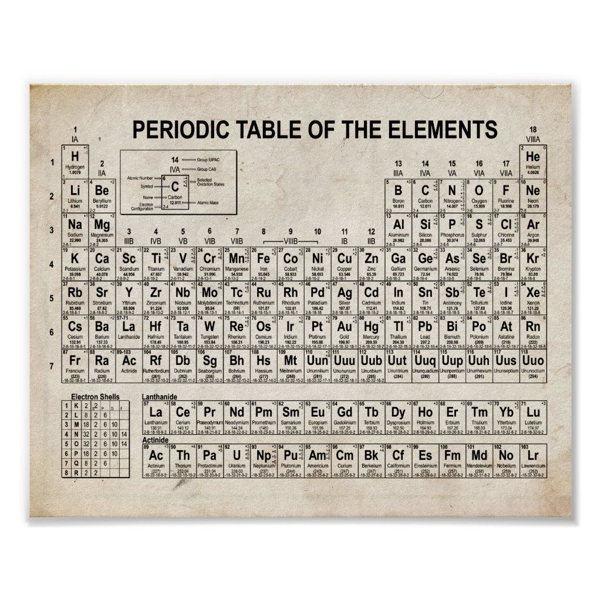
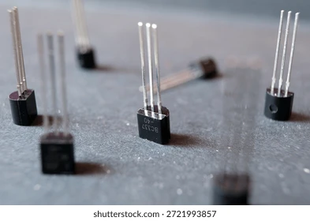
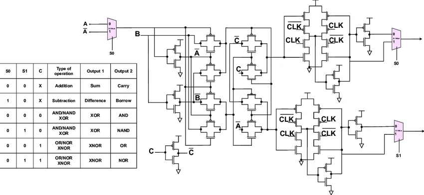
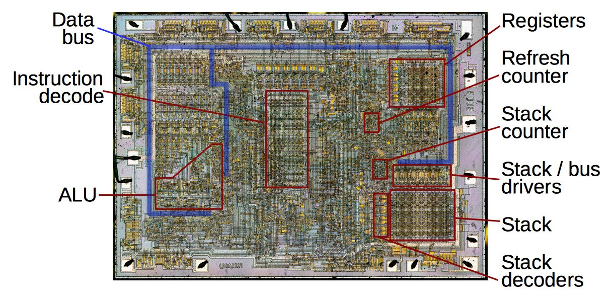
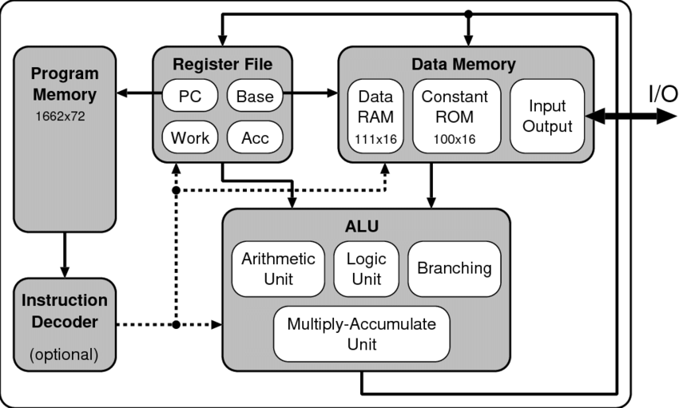
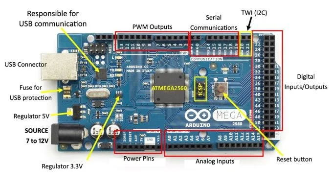
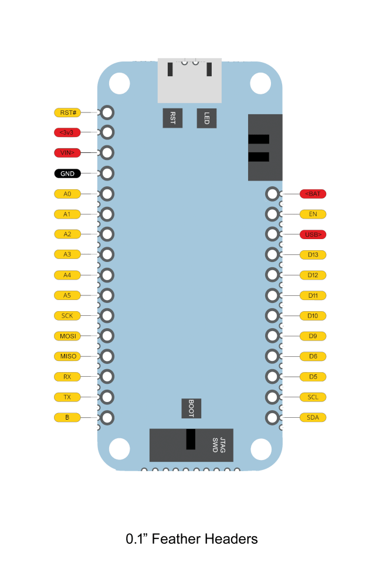

  
Mi primer nodo IoT ambiental

  <h1>Entendiendo el origen y fundamentos de los microcontroladores</h1>
  <a href="../actividades/antes-de-empezar" target="_top" class="quiet-link">Ir a las actividades</a>

---
class: image-story
---

  
Escena 2

  <h1>Materiales de origen: tierras raras</h1>
  
Algunos minerales de tierras raras participan en cadenas de suministro fundamentales para la fabricación de dispositivos electrónicos.

  

    tierras raras
    minerales
    chips
  

---
class: image-story materials-story
---

  
Escena 3

  <h1>Clasificación básica de materiales</h1>

  

    

      +
      <h2>Conductor</h2>
      
Deja pasar corriente con facilidad.

      <strong>Cobre, aluminio, oro.</strong>
    

    

      -
      <h2>Aislante</h2>
      
Dificulta el paso de corriente.

      <strong>Plástico, vidrio, cerámica.</strong>
    

    

      0/1
      <h2>Semiconductor</h2>
      
Permite modificar su conducción bajo condiciones controladas.

      <strong>Silicio.</strong>
    

  

  
La función esencial de un circuito integrado no es solo conducir electricidad, sino controlarla con precisión.

---
class: transistor-story
---

Escena 4

# El transistor: un semiconductor que podemos controlar

  

    <h2>Unidad fundamental de los circuitos integrados</h2>
    
Un transistor puede modelarse como un interruptor semiconductor: una señal aplicada a la compuerta regula el paso de corriente entre sus terminales.

  

  

    

      

        <strong>Fuente</strong>
        <small>entrada</small>
      

      

        
compuerta

        

          
          
          
        

        
0 bloquea

        
1 conduce

      

      

        <strong>Drenaje</strong>
        <small>salida</small>
      

    

    

      
símbolo

      <svg viewBox="0 0 220 220" role="img">
        <line class="schematic-line" x1="110" y1="30" x2="110" y2="72" />
        <line class="schematic-line" x1="110" y1="148" x2="110" y2="190" />
        <line class="schematic-line" x1="78" y1="74" x2="78" y2="146" />
        <line class="schematic-line" x1="110" y1="72" x2="78" y2="94" />
        <line class="schematic-line" x1="78" y1="126" x2="110" y2="148" />
        <line class="schematic-gate" x1="38" y1="110" x2="68" y2="110" />
        <line class="schematic-gate" x1="68" y1="78" x2="68" y2="142" />
        <path class="schematic-arrow" d="M101 141 L116 148 L105 160" />
        <text x="117" y="27">D</text>
        <text x="116" y="207">S</text>
        <text x="23" y="116">G</text>
      </svg>
      

        G: compuerta
        D/S: corriente
      

    

  

---
class: circuit-complexity
---

Escena 5

# La complejidad de los circuitos lógicos digitales

  

    

      memoria
      <h2>Biestable SR de 1 bit</h2>
      
Dos inversores acoplados por realimentación cruzada conservan un estado lógico estable.

    

    <svg class="logic-diagram latch-schematic" viewBox="0 0 560 280" role="img" aria-label="Biestable SR de un bit con transistores cruzados">
      <path class="wire rail-hot" d="M48 32H512" />
      <path class="wire rail-gnd" d="M48 248H512" />
      <text x="48" y="23">+5 V</text>
      <text x="48" y="268">GND</text>
      <path class="wire" d="M150 32V70" />
      <path class="wire" d="M410 32V70" />
      <path class="resistor" d="M150 70l-10 8 20 12-20 12 20 12-10 8v22" />
      <path class="resistor" d="M410 70l-10 8 20 12-20 12 20 12-10 8v22" />
      <text x="112" y="92">R1</text>
      <text x="424" y="92">R4</text>
      <circle class="node-out node-low" cx="150" cy="144" r="22" />
      <circle class="node-out node-high" cx="410" cy="144" r="22" />
      <text x="136" y="151">Q̅=0</text>
      <text x="396" y="151">Q=1</text>
      <path class="wire feedback-a" d="M172 144C230 96 318 96 388 144" />
      <path class="wire feedback-b" d="M388 144C318 198 230 198 172 144" />
      <circle class="transistor off" cx="150" cy="205" r="34" />
      <circle class="transistor on" cx="410" cy="205" r="34" />
      <path class="gate-line" d="M125 185v40" />
      <path class="gate-line" d="M385 185v40" />
      <path class="wire" d="M150 166v5M150 239v9M410 166v5M410 239v9" />
      <text x="134" y="210">Q1</text>
      <text x="394" y="210">Q2</text>
      <path class="wire input-wire" d="M250 248V214" />
      <path class="wire input-wire active" d="M310 248V214" />
      <rect class="input-key" x="226" y="180" width="48" height="34" rx="6" />
      <rect class="input-key active" x="286" y="180" width="48" height="34" rx="6" />
      <text x="244" y="202">R</text>
      <text x="304" y="202">S</text>
      <circle class="signal signal-latch-a" cx="172" cy="144" r="5" />
      <circle class="signal signal-latch-b" cx="388" cy="144" r="5" />
      <rect class="state-label" x="202" y="50" width="156" height="32" rx="16" />
      <text class="state-text" x="220" y="71">estado estable: Q=1</text>
    </svg>
  

  

    

      cálculo
      <h2>Sumador completo de 1 bit</h2>
      
Una red combinacional implementa S = A ⊕ B ⊕ Cin y Cout = AB + Cin(A ⊕ B).

    

    <svg class="logic-diagram adder-schematic" viewBox="0 0 560 280" role="img" aria-label="Sumador completo de un bit con compuertas XOR AND y OR">
      <text x="34" y="62">A=1</text>
      <text x="34" y="112">B=1</text>
      <text x="34" y="192">Cin=0</text>
      <path class="wire active" d="M86 58H168" />
      <path class="wire active" d="M86 108H168" />
      <path class="wire muted" d="M86 188H246" />
      <path class="gate xor" d="M168 38C218 38 244 58 258 84C244 110 218 130 168 130C188 104 188 64 168 38Z" />
      <path class="gate-shadow" d="M154 38C174 64 174 104 154 130" />
      <text x="198" y="90">XOR</text>
      <path class="wire active" d="M258 84H318" />
      <path class="wire muted" d="M246 188H318" />
      <path class="gate xor" d="M318 64C368 64 394 84 408 110C394 136 368 156 318 156C338 130 338 90 318 64Z" />
      <path class="gate-shadow" d="M304 64C324 90 324 130 304 156" />
      <text x="348" y="116">XOR</text>
      <path class="wire muted" d="M408 110H500" />
      <text x="508" y="116">S=0</text>
      <path class="wire active" d="M116 58V166H184" />
      <path class="wire active" d="M116 108V206H184" />
      <path class="gate and" d="M184 154H220C246 154 262 166 262 180C262 194 246 206 220 206H184Z" />
      <text x="203" y="184">AND</text>
      <path class="wire active" d="M262 180H370" />
      <path class="wire active" d="M258 84V226H184" />
      <path class="wire muted" d="M246 188V246H184" />
      <path class="gate and" d="M184 214H220C246 214 262 226 262 240C262 254 246 266 220 266H184Z" />
      <text x="203" y="244">AND</text>
      <path class="wire muted" d="M262 240H370" />
      <path class="gate or" d="M370 166C420 166 450 186 466 210C450 234 420 254 370 254C392 228 392 192 370 166Z" />
      <text x="407" y="216">OR</text>
      <path class="wire active" d="M466 210H500" />
      <text x="508" y="216">Cout=1</text>
      <circle class="signal signal-adder-a" cx="86" cy="58" r="5" />
      <circle class="signal signal-adder-b" cx="86" cy="108" r="5" />
      <circle class="signal signal-adder-c" cx="466" cy="210" r="5" />
    </svg>
  

---
class: microprocessor-intro
---

Escena 6

# El microprocesador

  

    <h2>Intel 4004, 1971</h2>
    
El Intel 4004 fue el primer microprocesador comercial en un solo chip: una unidad central de procesamiento implementada como circuito integrado.

    

      4 bits
      ≈ 2 300 transistores
      CPU en un encapsulado
    

  

  <figure class="chip-photo">
    
    <figcaption>Encapsulado físico</figcaption>
  </figure>
  <figure class="die-photo">
    
    <figcaption>Circuito integrado por dentro</figcaption>
  </figure>
  <figure class="block-photo">
    
    <figcaption>Modelo de bloques: memoria, registros, ALU, control y entrada/salida</figcaption>
  </figure>

---
class: microcontroller-slide
---

Escena 7

# El microcontrolador

  

    <h2>Microprocesador vs. microcontrolador</h2>
    
Un microprocesador concentra la CPU. Un microcontrolador integra CPU, memoria, temporizadores y puertos de entrada/salida en el mismo circuito integrado.

    

      

        <b>Microprocesador</b>
        necesita memoria y periféricos externos
      

      

        <b>Microcontrolador</b>
        incluye recursos para controlar el mundo físico
      

    

    

      CPU
      Flash
      RAM
      Temporizadores
      GPIO
      ADC
      UART/I2C/SPI
    

    
En el taller se utilizará la <strong>Blues Swan R5</strong>: para trabajar con Arduino IDE, el puerto de comunicación y el modo de carga.

    <a href="../actividades/antes-de-empezar" target="_top" class="mcu-prepare-link" aria-label="Abrir la actividad Antes de empezar para preparar la Blues Swan R5">
      Siguiente paso
      <strong>Preparar la tarjeta Swan</strong>
      <small>IDE, puerto y carga</small>
      -&gt;
    </a>
  

  <figure class="mcu-board">
    
  </figure>

---

Escena 12

# Del algoritmo a instrucciones en memoria

  

    

      <b>Algoritmo</b>
      Secuencia finita de pasos: inicializar, decidir, repetir y producir una salida.
    

    

      digitalWrite(HIGH);
      delay(1000);
      digitalWrite(LOW);
      delay(1000);
    

    

      programa
      compilador
      binario
      Flash
      <i></i>
    

    

      
<b>secuencia</b>paso 1 → paso 2

      
<b>if</b>seleccionar una ruta

      
<b>while / for</b>repetir mientras se cumpla una condición

    

    
El programa se traduce a instrucciones binarias y queda guardado en Flash. La CPU las lee en orden, salvo cuando una condición o un ciclo cambia el flujo.

  

  

    
<b>Memoria de programa</b><small>guarda el código</small>

    
<b>Contador de programa</b><small>PC: siguiente dirección</small>

    
<b>Decodificador</b><small>decodifica la instrucción</small>

    
<b>Registros</b><small>datos inmediatos</small>

    
<b>Unidad lógica</b><small>ALU: calcula y compara</small>

    
<b>Memoria de datos</b><small>RAM: variables</small>

    
<b>Entradas y salidas</b><small>GPIO: voltaje al LED</small>

    
    
    
  

  <a href="../actividades/tiempo-dentro-del-chip" target="_top" class="machine-caption machine-activity-link" aria-label="Ir a la Actividad 1 Algoritmo memoria y tiempo visible">
    <b>Ciclo de ejecución</b>
    buscar → decodificar → ejecutar → actualizar el LED → repetir en la Actividad 1
  </a>

---
class: delay-slide
---

Escena 13

# Qué ocurre durante `delay(1000)`

  

    

      <b>01</b> digitalWrite(LED_BUILTIN, HIGH);
      <b>02</b> delay(1000);
      <b>03</b> digitalWrite(LED_BUILTIN, LOW);
      <b>04</b> delay(1000);
      <i class="code-scan"></i>
    

    

      <b>Concepto clave</b>
      `delay(1000)` no es una sola instrucción del microcontrolador. Es una función que espera hasta que la base de tiempo acumule 1000 milisegundos.
    

    

      
<b>base de tiempo</b>un temporizador actualiza un contador de milisegundos<small>Arduino utiliza este principio para `delay()`</small>

      
<b>espera activa</b>leer → comparar → repetir si todavía falta tiempo<small>el procesador permanece ocupado esperando</small>

      
<b>retardo manual</b>un `while` o `for` consume ciclos de reloj<small>se estima con frecuencia y ciclos por vuelta</small>

    

  

  

    

      <b>Oscilador</b>
      <small>marca el ritmo eléctrico</small>
      millones de ciclos por segundo
    

    

      
      <i class="cycle-runner"></i>
    

    

      
<b>ciclo</b>un latido del reloj interno

      
<b>instrucción</b>puede tomar uno o varios ciclos

      
<b>interrupción</b>una pausa breve para actualizar el tiempo

    

    

      

        
<b>reloj</b>pulsos muy rápidos

        <i></i>
        
<b>divisor</b>baja la velocidad de conteo

        <i></i>
        
<b>temporizador</b>avisa cada 1 ms

        <i></i>
        
<b>contador</b>0, 1, 2... 1000 ms

      

      

        <strong>Mientras tanto, el procesador espera</strong>
        
<b>leer</b>tiempo actual

        
<b>restar</b>actual - inicio

        
<b>comparar</b>¿ya son 1000?

        
<b>saltar</b>si falta tiempo, repetir

      

      

        <strong>Retardo implementado manualmente</strong>
        <code>while (contador &gt; 0) { &nbsp;&nbsp;NOP(); contador--; }</code>
        

          <b>tiempo ≈ vueltas × ciclos/vuelta ÷ F_CPU</b>
          120 MHz y 5 ciclos/vuelta → 24 M vueltas ≈ 1 s
        

      

    

    <a href="../actividades/tiempo-dentro-del-chip" target="_top" class="mcu-prepare-link timing-next-link timing-activity-link" aria-label="Ir a la Actividad 1 Fundamentos de programa memoria y tiempo">
      Siguiente actividad
      <strong>Actividad 1: fundamentos de programa, memoria y tiempo</strong>
      <small>algoritmo, memoria, tiempo visible y retardo manual</small>
      -&gt;
    </a>
  

---
class: protocol-book-slide
---

Escena 14

# I2C y UART: dos formas de ordenar una conversación serial

<b>Protocolo de comunicación.</b> Conjunto de reglas que define cómo representar bits, qué líneas físicas utilizar, cómo iniciar mensajes y en qué instante leer cada señal.

<section class="book-panel i2c-panel"><header><b>I2C</b>síncrono · bus compartido</header><svg viewBox="0 0 520 175" role="img" aria-label="Bus I2C con SDA SCL y tres dispositivos direccionados"><rect class="chip master" x="20" y="70" width="82" height="54" rx="8"/><text x="61" y="93">Swan</text><text x="61" y="111">maestro</text><path class="bus sda" d="M120 62H490"/><path class="bus scl" d="M120 118H490"/><text class="wire-label" x="124" y="53">SDA datos</text><text class="wire-label" x="124" y="140">SCL reloj</text><g class="i2c-device d1"><path d="M205 62V34"/><path d="M205 118V34"/><rect class="chip" x="175" y="12" width="60" height="38" rx="7"/><text x="205" y="76">0x40</text></g><g class="i2c-device d2"><path d="M320 62V34"/><path d="M320 118V34"/><rect class="chip" x="290" y="12" width="60" height="38" rx="7"/><text x="320" y="76">0x64</text></g><g class="i2c-device d3"><path d="M435 62V34"/><path d="M435 118V34"/><rect class="chip" x="405" y="12" width="60" height="38" rx="7"/><text x="435" y="76">0x81</text></g><circle class="pulse address-pulse" cx="205" cy="62" r="6"/><polyline class="clock-wave-svg" points="210,118 220,118 220,103 232,103 232,118 244,118 244,103 256,103 256,118 268,118 268,103 280,103 280,118 292,118"/><text class="caption" x="20" y="160">Todos escuchan el bus; responde solo la dirección solicitada.</text></svg></section><section class="book-panel uart-panel"><header><b>UART</b>asíncrono · punto a punto</header><svg viewBox="0 0 520 175" role="img" aria-label="Comunicación UART punto a punto con TX RX y trama asíncrona"><rect class="chip master uart-chip" x="35" y="66" width="88" height="66" rx="8"/><text x="79" y="94">Swan</text><text x="79" y="112">UART</text><rect class="chip module" x="398" y="66" width="88" height="66" rx="8"/><text x="442" y="94">Módulo</text><text x="442" y="112">UART</text><path class="bus uart-tx" d="M135 78H388"/><path class="bus uart-rx" d="M388 122H135"/><text class="wire-label" x="140" y="68">TX -> RX</text><text class="wire-label" x="316" y="144">RX <- TX</text><g class="uart-frame"><text x="190" y="36">trama: inicio · datos · parada</text><path d="M190 48h18v16h18V48h18v16h18V48h18v16h18V48h18v16h18"/></g><rect class="baud" x="185" y="138" width="145" height="23" rx="6"/><text x="257" y="154">velocidad común</text><circle class="pulse uart-pulse" cx="255" cy="78" r="6"/><text class="caption" x="35" y="160">No hay línea de reloj; ambos extremos acuerdan velocidad.</text></svg></section>

<b>Lectura técnica</b>I2C permite varios sensores con dos líneas y direcciones. UART usa dos líneas para una conversación directa entre dos extremos.

---
class: swan-pins-book-slide
---

Escena 14B

# Pines de la Swan: GPIO y funciones de comunicación

<figure><figcaption>Pinout oficial Blues Swan v3.0</figcaption></figure>

<b>GPIO</b> significa entrada/salida de propósito general. Un pin configurado como GPIO permite que el programa lea un nivel lógico o produzca un voltaje digital. Cuando el pin se asigna a un periférico interno, la misma terminal física puede convertirse en parte de un protocolo de comunicación.

<b>Uso general</b>D5, D6, D9, D10...<small>LED, botón, salida digital, lectura HIGH/LOW.</small>

<b>I2C</b>SDA + SCL<small>Bus síncrono para múltiples sensores con dirección.</small>

<b>UART</b>TX + RX<small>Enlace asíncrono entre dos extremos con una velocidad previamente acordada.</small>

<b>SPI</b>SCK + MOSI + MISO + CS<small>Bus síncrono rápido; el pin CS selecciona el dispositivo activo.</small>

<a href="../actividades/hola-mundo" target="_top" class="mcu-prepare-link pin-activity-link" aria-label="Ir a la Actividad 2 Lectura ambiental con SEN55 por I2C">Siguiente actividad<strong>Actividad 2: lectura ambiental con SEN55 por I2C</strong><small>usar las líneas SDA y SCL para obtener partículas, temperatura, humedad, VOC y NOx</small>-&gt;</a>

---
class: comm-foundation-slide
---

Escena 15

# Modulación: representar información mediante una onda

<svg class="am-waves" viewBox="0 0 740 360" role="img" aria-label="Mensaje portadora y señal modulada en amplitud"><defs><marker id="timeArrow" markerWidth="9" markerHeight="9" refX="7" refY="4.5" orient="auto"><path d="M0,0 L9,4.5 L0,9 z" fill="#1f3a93"/></marker></defs><line class="am-axis-y" x1="100" y1="310" x2="100" y2="32" marker-end="url(#timeArrow)"/><text class="am-axis-title" x="118" y="35">Amplitud</text><text class="am-row-label" x="18" y="82">Mensaje</text><line class="am-axis" x1="100" y1="82" x2="690" y2="82" marker-end="url(#timeArrow)"/><path class="am-message" d="M100 82 C135 45 160 45 192 82 S260 122 304 82 S388 35 458 82 S560 130 646 82"/><text class="am-time" x="696" y="77">Tiempo</text><text class="am-row-label" x="16" y="178">Portadora</text><line class="am-axis" x1="100" y1="178" x2="690" y2="178" marker-end="url(#timeArrow)"/><path class="am-carrier" d="M100 178 q9 -34 18 0 t18 0 t18 0 t18 0 t18 0 t18 0 t18 0 t18 0 t18 0 t18 0 t18 0 t18 0 t18 0 t18 0 t18 0 t18 0 t18 0 t18 0 t18 0 t18 0 t18 0 t18 0 t18 0 t18 0 t18 0 t18 0 t18 0 t18 0 t18 0 t18 0 t18 0 t18 0"/><text class="am-time" x="696" y="173">Tiempo</text><text class="am-row-label" x="30" y="282">AM</text><line class="am-axis" x1="100" y1="282" x2="690" y2="282" marker-end="url(#timeArrow)"/><path class="am-envelope top" d="M100 282 C135 224 160 224 192 282 S260 322 304 282 S388 210 458 282 S560 334 646 282"/><path class="am-envelope bottom" d="M100 282 C135 340 160 340 192 282 S260 242 304 282 S388 354 458 282 S560 230 646 282"/><path class="am-signal" d="M100 282 q8 -28 16 0 t16 0 q8 -48 16 0 t16 0 q8 -62 16 0 t16 0 q8 -46 16 0 t16 0 q8 -30 16 0 t16 0 q8 -18 16 0 t16 0 q8 -22 16 0 t16 0 q8 -36 16 0 t16 0 q8 -56 16 0 t16 0 q8 -68 16 0 t16 0 q8 -50 16 0 t16 0 q8 -32 16 0 t16 0 q8 -22 16 0 t16 0 q8 -30 16 0 t16 0 q8 -46 16 0 t16 0 q8 -60 16 0 t16 0 q8 -40 16 0 t16 0"/><circle class="am-scan-dot" cx="100" cy="282" r="6"/></svg>
<svg viewBox="0 0 330 260" role="img" aria-label="Mezclador con mensaje oscilador y salida de radio"><path class="mini-wave" d="M22 62 q13 -16 26 0 t26 0 t26 0"/><path class="mini-arrow" d="M108 62H150"/><path class="mini-carrier" d="M86 168 q6 -34 12 0 t12 0 t12 0 t12 0 t12 0 t12 0"/><path class="mini-arrow vertical" d="M158 190V128"/><circle class="mixer-circle" cx="172" cy="96" r="26"/><text class="mixer-x" x="172" y="103">x</text><rect class="osc-box" x="118" y="196" width="82" height="38" rx="4"/><text class="osc-text" x="159" y="219">Oscilador</text><path class="mini-arrow" d="M198 96H260"/><path class="mini-am" d="M260 96 q5 -18 10 0 t10 0 q5 -32 10 0 t10 0 q5 -18 10 0 t10 0"/><text class="mixer-caption" x="26" y="34">mensaje</text><text class="mixer-caption" x="112" y="252">portadora estable</text><text class="mixer-caption" x="236" y="52">señal modulada</text></svg>
<b>Modular</b> consiste en variar una onda portadora de acuerdo con el mensaje. En una radio digital real cambian propiedades de la señal para representar bits; la idea central es la misma: el dato no se transmite de forma abstracta: viaja codificado en una señal física.

---
class: comm-foundation-slide
---

Escena 15B

# De sensores IoT a Notehub

<i></i><b>humedad</b>

<i></i><b>inclinación</b>

<i></i><b>fuga</b>

<i></i><b>partículas</b>

<i></i><b>suelo</b>

<i></i><b>temperatura</b>

<svg class="lorawan-map" viewBox="0 0 860 430" role="img" aria-label="Arquitectura LoRaWAN con nodos, pasarelas, Notehub y aplicaciones"><defs><marker id="blueArrow" markerWidth="8" markerHeight="8" refX="7" refY="4" orient="auto"><path d="M0,0 L8,4 L0,8 z" fill="#006fc9"/></marker></defs><g class="field-sensor"><circle cx="70" cy="220" r="18"/><text x="70" y="255">nodo</text><text x="70" y="276">ambiental</text></g><g class="gateway-icon g1"><rect x="245" y="70" width="150" height="48" rx="5"/><text x="320" y="100">Pasarela LoRa</text><path d="M305 60 q15 -22 30 0"/><path d="M292 50 q28 -42 56 0"/></g><g class="gateway-icon g2"><rect x="245" y="186" width="150" height="48" rx="5"/><text x="320" y="216">Pasarela LoRa</text><path d="M305 176 q15 -22 30 0"/><path d="M292 166 q28 -42 56 0"/></g><g class="gateway-icon g3"><rect x="245" y="302" width="150" height="48" rx="5"/><text x="320" y="332">Pasarela LoRa</text><path d="M305 292 q15 -22 30 0"/><path d="M292 282 q28 -42 56 0"/></g><path class="node-radio r1" d="M88 215 C145 160 190 94 245 94" marker-end="url(#blueArrow)"/><path class="node-radio r2" d="M90 220 C145 220 190 210 245 210" marker-end="url(#blueArrow)"/><path class="node-radio r3" d="M88 225 C145 282 190 326 245 326" marker-end="url(#blueArrow)"/><path class="gateway-backhaul" d="M395 94 H475 V326 H395"/><path class="gateway-main" d="M475 210 H555"/><g class="cloud"><path d="M600 120 C620 82 680 86 698 122 C740 118 780 150 780 196 C780 243 744 272 690 272 H608 C558 272 528 242 528 200 C528 160 560 128 600 120Z"/><rect x="592" y="150" width="122" height="82" rx="7"/><text x="653" y="178">LoRa</text><text x="653" y="199">Red</text><text x="653" y="220">Servidor</text><text class="notehub-label" x="653" y="286">Notehub / proyecto</text></g><g class="apps"><rect x="790" y="90" width="46" height="42" rx="5"/><rect x="800" y="170" width="46" height="42" rx="5"/><rect x="775" y="250" width="46" height="42" rx="5"/><text x="813" y="114">App</text><text x="823" y="194">CSV</text><text x="798" y="274">Tablero</text></g><path class="app-line" d="M714 172 C748 120 770 112 790 112"/><path class="app-line" d="M714 194 C750 188 770 190 800 190"/><path class="app-line" d="M714 220 C745 250 758 268 775 268"/></svg>
<b>La transmisión de radio no llega directamente al tablero.</b>El nodo transmite paquetes pequeños por LoRa. Una pasarela los recibe, los conduce hacia Internet y Notehub conserva los datos asociados al ProductUID para su análisis o descarga.

---
class: comm-foundation-slide
---

Escena 15C

# Alcance, energía y ancho de banda

<svg viewBox="0 0 900 410" role="img" aria-label="Comparación de alcance y ancho de banda entre WiFi BLE celular y LoRa"><defs><marker id="arrowHead" markerWidth="9" markerHeight="9" refX="7" refY="4.5" orient="auto"><path d="M0,0 L9,4.5 L0,9 z" fill="#6b7280"/></marker></defs><line class="range-axis" x1="95" y1="350" x2="845" y2="350" marker-end="url(#arrowHead)"/><line class="range-axis" x1="95" y1="350" x2="95" y2="45" marker-end="url(#arrowHead)"/><text class="axis-title" x="412" y="390">alcance</text><text class="axis-title vertical" x="35" y="235">ancho de banda</text><text class="axis-tick" x="94" y="378">corto</text><text class="axis-tick" x="804" y="378">largo</text><text class="axis-tick" x="45" y="60">alto</text><text class="axis-tick" x="48" y="342">bajo</text><ellipse class="bubble wifi-bubble" cx="285" cy="170" rx="130" ry="118"/><text class="bubble-title" x="238" y="145">WiFi / BLE</text><text class="bubble-copy" x="218" y="172">muchos datos</text><text class="bubble-copy" x="225" y="198">poca distancia</text><ellipse class="bubble cellular-bubble" cx="545" cy="120" rx="190" ry="78"/><text class="bubble-title" x="492" y="108">Celular</text><text class="bubble-copy" x="448" y="136">cobertura amplia, más energía</text><ellipse class="bubble lora-bubble" cx="560" cy="260" rx="318" ry="86"/><text class="bubble-title lora-title" x="515" y="250">LoRa</text><text class="bubble-copy" x="423" y="280">sensores, actuadores y mensajes pequeños</text></svg>
<b>Decisión de diseño</b>Un nodo ambiental no requiere transmitir video ni voz. Su función es enviar pocos campos de medición, con bajo consumo, desde lugares donde el acceso a una red local puede ser limitado.

---
class: comm-foundation-slide
---

Escena 15D

# Del programa al dato en Notehub

<b>setup()</b>preparar la ruta<code>Wire.begin(); notecard.begin();</code>

<b>hub.set</b>identidad del proyecto<code>ProductUID mode: continuous</code>

<b>note.template</b>formato compacto<code>file: sensors.qo port: 10</code>

<b>loop()</b>construir una medición<code>body.counter body.temp</code>

<b>hub.sync</b>solicitar envío<code>sync: true</code>
<svg class="firmware-rail" viewBox="0 0 980 210" role="img" aria-label="Línea de flujo del código hacia Notehub"><path class="rail-line" d="M40 106 H930"/><g class="rail-node"><circle cx="65" cy="106" r="13"/><text x="65" y="148">I2C</text></g><g class="rail-node"><circle cx="265" cy="106" r="13"/><text x="265" y="148">hub</text></g><g class="rail-node"><circle cx="470" cy="106" r="13"/><text x="470" y="148">plantilla</text></g><g class="rail-node"><circle cx="675" cy="106" r="13"/><text x="675" y="148">nota</text></g><g class="rail-node"><circle cx="885" cy="106" r="13"/><text x="885" y="148">Notehub</text></g><rect class="moving-packet" x="38" y="74" width="76" height="34" rx="6"/><text class="packet-text" x="76" y="96">sensors.qo</text></svg>
<b>Contenido de la nota</b>counter: 1temp: 25.5humidity: 55.0battery: 3.7

<b>Lectura de código.</b> La Swan no administra toda la red: construye solicitudes para la Notecard. La Notecard conserva la nota, usa la plantilla para compactarla y sincroniza cuando existe una ruta hacia Notehub.

<a href="../actividades/sensor-simulado" target="_top" class="mcu-prepare-link comm-activity-link compact-comm-activity" aria-label="Ir a la Actividad 3 Comunicación del nodo y firmware final">Siguiente actividad<strong>Actividad 3: comunicación del nodo y firmware final</strong><small>analizar el código por capas: I2C, Notecard, plantilla, nota y sincronización</small>-&gt;</a>

---
layout: center
class: statement
---

Cierre

# Un dato pequeño puede sustentar una interpretación amplia

<v-clicks>

- Un LED permite estudiar el control de una salida.
- Un sensor permite medir variables del entorno.
- Un conjunto de mediciones permite interpretar espacios reales.

</v-clicks>

<a href="../actividades/antes-de-empezar" target="_top" class="quiet-link">Iniciar actividades</a>
